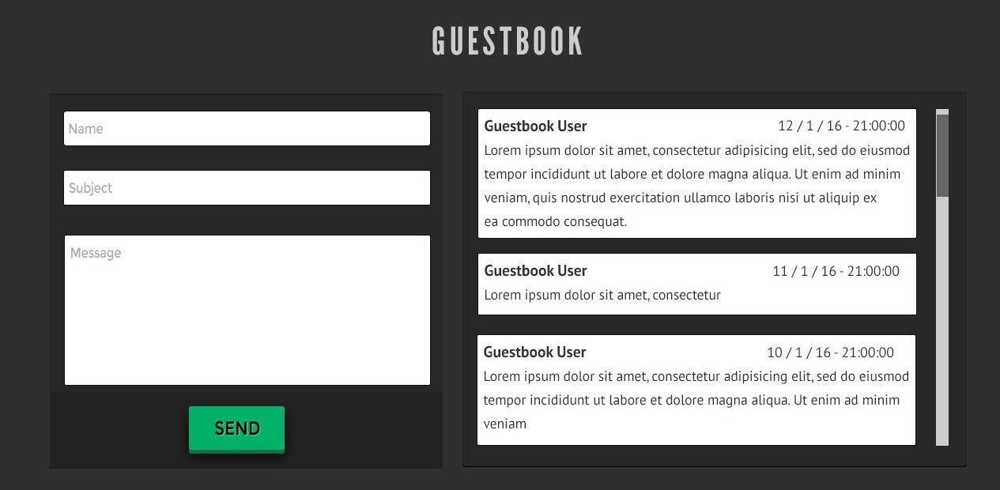

# Guestbook API

### Summary:

This is simple Guestbook API that users can
- Add entries
- List entries
- List users with total entry count and last entry


Note: It is a visual representation. The project does not contain frontend.

### Requirements:

```
docker
```

### Run:

```
cp config/.env.example config/.env
docker compose up --build
```

### Test (3/3):

```
docker exec django python manage.py test
```

### Coverage (%97):

```
docker exec django coverage run manage.py test
docker exec django coverage report
```

### Docs:

```
Postman: postman_collection.json in the project root.
```

### Endpoints:

```http request
POST   /guestbook/entries/  # create entry
GET    /guestbook/entries/  # list entries
GET    /guestbook/users/    # list users
```

### Example Requests/Responses:

#### Request:
```http request
POST /guestbook/entries/

Body:
{
    "name": "Alperen",
    "subject": "Hello",
    "message": "Hello World"
}
```

#### Response:
```json
{
    "user": "Alperen",
    "subject": "Hello",
    "message": "Hello World"
}
```

#### Request:
```http request
GET /guestbook/entries/?page=1&page_size=3

Query:
page: int = Page number (optional) (default=1)
page_size: int = Items per page (optional) (default=3)
```

#### Response:
```json
{
    "count": 33,
    "page_size": 3,
    "total_pages": 11,
    "current_page_number": 1,
    "links": {
        "next": "http://localhost:8000/guestbook/entries/?page=2&page_size=3",
        "previous": null
    },
    "entries": [
        {
            "user": "Alperen",
            "subject": "Hello",
            "message": "Hello World"
        },
        {
            "user": "User 2",
            "subject": "Subject 5",
            "message": "Message 5"
        },
        {
            "user": "User 1",
            "subject": "Subject 2",
            "message": "Message 2"
        }
    ]
}
```

#### Request:
```http request
GET /guestbook/users/
```

#### Response:
```json
{
    "users": [
        {
            "username": "Alperen",
            "total_message_count": 1,
            "last_entry": "Hello | Hello World"
        },
        {
            "username": "User 2",
            "total_message_count": 5,
            "last_entry": "Subject 5 | Message 5"
        },
        {
            "username": "User 1",
            "total_message_count": 2,
            "last_entry": "Subject 2 | Message 2"
        }
    ]
}
```

### Database Tables:

```
User: (id, name, created_date)
Entry: (id, subject, message, created_date, user_id[fk])
```

### SQL Queries:
<details>
<summary>Clik to Show SQL Query (POST /guestbook/entries/)</summary>

```sql
BEGIN;
args = None;
alias = default 
SELECT 
  "guestbook_user"."id", 
  "guestbook_user"."name", 
  "guestbook_user"."created_date" 
FROM 
  "guestbook_user" 
WHERE 
  "guestbook_user"."name" = 'Alperen' 
LIMIT 
  21;
args =('Alperen',);
ali as = default INSERT INTO "guestbook_entry" (
  "subject", "message", "created_date", 
  "user_id"
) 
VALUES 
  (
    'Hello', 'Hello World', '2024-03-16 00:19:22.343243+00:00' :: timestamptz, 
    9
  ) RETURNING "guestbook_entry"."id";
args =(
  'Hello', 
  'Hello World', 
  datetime.datetime(
    2024, 3, 16, 0, 19, 22, 343243, tzinfo = datetime.timezone.utc
  ), 
  9
);
alias = default COMMIT;
args = None;
alias = default
```
</details>

<details>
<summary>Clik to Show SQL Query (GET /guestbook/entries/)</summary>

```sql
SELECT 
  "guestbook_user"."name" AS "username", 
  COUNT("guestbook_entry"."id") AS "total_message_count", 
  (
    SELECT 
      CONCAT(
        (U0."subject"):: text, 
        (
          CONCAT(
            (' | '):: text, 
            (U0."message"):: text
          )
        ):: text
      ) AS "last_entry" 
    FROM 
      "guestbook_entry" U0 
    WHERE 
      U0."user_id" = ("guestbook_user"."id") 
    ORDER BY 
      U0."created_date" DESC 
    LIMIT 
      1
  ) AS "last_entry" 
FROM 
  "guestbook_user" 
  LEFT OUTER JOIN "guestbook_entry" ON (
    "guestbook_user"."id" = "guestbook_entry"."user_id"
  ) 
GROUP BY 
  "guestbook_user"."id" 
ORDER BY 
  "guestbook_user"."id" DESC;
args =(' | ',);
alias = default
```
</details>

<details>
<summary>Clik to Show SQL Query (GET /guestbook/users/)</summary>

```sql
SELECT 
  COUNT(*) AS "__count" 
FROM 
  "guestbook_entry" 
  INNER JOIN "guestbook_user" ON (
    "guestbook_entry"."user_id" = "guestbook_user"."id"
  );
args =();
alias = default 
SELECT 
  "guestbook_entry"."subject", 
  "guestbook_entry"."message", 
  "guestbook_user"."name" AS "username" 
FROM 
  "guestbook_entry" 
  INNER JOIN "guestbook_user" ON (
    "guestbook_entry"."user_id" = "guestbook_user"."id"
  ) 
ORDER BY 
  "guestbook_entry"."created_date" DESC 
LIMIT 
  3;
args =();
alias = default
```
</details>
